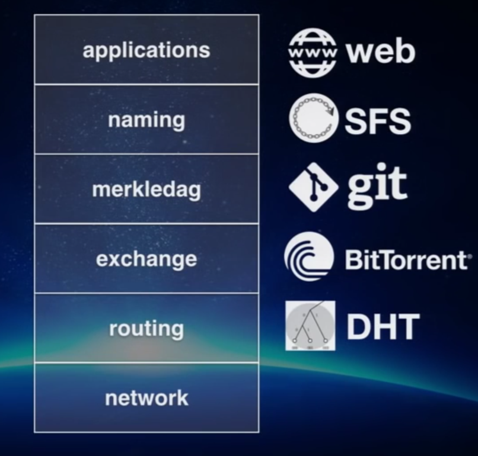

# IPFS

> The InterPlanetary File System

Making the web faster, safer and more open.

---

## Protocols

> The web is a collection of protocols

Note: Aim to augment what we can do.  
If you have an idea on what humanity should be able to do, just write a
protocol.

----

<!-- .slide: data-background="resources/baran-networks.jpg" -->

Note: Paul Baran's first categorization of networks. The structure of a network
can have vast implications in the uses of the protocols.  
 * Centralized: Easy to change, but power in one location
 * Decentralized: more resilient, but not the same resiliency if everyone spoke
   the same protocol
 * Distributed: everything can talk to everything else, extremely resilient
   fabric

----

Kind of a nervous system, right?

<!-- .slide: data-background="resources/internet.jpg" -->

Note: we've become so dependent on it -- we use it for everything

----

<!-- .slide: data-background="resources/ip-thin-waist.jpg" -->

Note: It's just a collection of protocols -- bunch of really good ideas,
implemented and deployed, that made the whole thing work.  
Remarkable feat of engineering and design to construct an architecture that
would scale to the use of today.
A "thin waist" to allow the lower and upper layers of the network to evolve
separately -- and only have a very small protocol in between that would mediate
how the whole network would grow.

----


Note: You take these ideas, if they're good enough, you write specs, you turn
those specs into code, you deploy it into computers, and you enhance humans.

----

Not many ideas end up being used.


---

## HTTP

The problem: how we move application through the web.

---

### Location addressing

```
http://example.com/foo/bar/baz.jpg
           ┃
           ┃
           V
http://10.20.30.40/foo/bar/baz.jpg
```

Note: show dns -> address translatation  
show what it means, to search for the computer  
we're telling where to find something instead of what

---

### Bandwidth


Note: huge loss ! same with video !

----


----

 <!-- .element height="43%" width="43%" -->

----


---

### Being offline

<!-- .slide: data-background="resources/offline.png" -->

Note: bad model  
we carry more and more devices around, and many in context they are not  
connected to any network  
Demonstrate google docs addiction to backbone  
If disconnected, they cannot share their modification, but they're all using  
the app!  
They could have used webrtc, but they don't  
You take out the mothership and nothing works

---

### Infrastructure problems

Yes, a lot of problems can happen

---

#### Travel

<!-- .slide: data-background="resources/insideplane.jpg" -->

---

#### ISP outage


---

#### Datacenter

<!-- .slide: data-background="resources/burned-bitcoin-mine.jpg" -->

---

#### Censorship


Note: It matters, the apps potientally saves life, ask egyptians.

---

### Security


Note: tesco tweet, dropbox leak, prism, google

----


----


----

We're encrypting communications.


----

We should be encrypting data.


---

### Data control

<!-- .slide: data-background="resources/data-control.png" -->

Note: Corps control our data, the link given to people is a link that
specifically goes to their website. They can censure it or they can disappear,
you can close your account etc...  
The point of the web was to build pieces of informations that you can interlink
between each other. Not to rely on gatekeeper and apps that design how we
access things.

---

### Permanence

_Knownledge is precious..._

----

<!-- .slide: data-background="resources/autodafe.png" -->

Note: Book burning? Knowledge is precious!  
We're losing knownledge everyday (404)

----

_... But we're losing a lot if it everyday._ 


----

_Imagine..._


Note: Imagine stackoverflow going away

----

We live in a web of documents on machines

<!-- .slide: data-background="resources/web-of-docs-on-machines.png" -->

Note: Every document is interconnected, if we lose some of them, we lose
meaning

----

An initiative: The Internet Archive

<!-- .slide: data-background="resources/internet-archive.jpg" -->

[_archive.org_](https://archive.org)

Note: some people took the initiative: archive.org  
explain what they do and why

----

Digital Vellum

Note: Data so old that it has lost meaning, uninterpretable. Can be so, but at
a huge cost.

---

## Upgrading the web

----

<!-- .slide: data-background="resources/upgrade-the-web.jpg" -->

Note: Make something that doesn't change the interface. If you make something
that cause people to have to change how they think about their system, it won't
work.

---

### IPFS

<!-- .slide: data-background="resources/ipfs-goals.png" -->

Note: Emphasize on _"faster"_.

---

Just like HTTP, IPFS is a __hypermedia transport protocol__.

Note: An algorithm or program that moves around data with links.

---

An Intergalactic Computer Network


Note: What would become ARPANET.  
Make it work accross huge distances -- same idea behind IPFS

---

#### The IPFS stack

----

 <!-- .element: width="70%" height="70%" -->

Note: Took inspiration from all of these protocols.  
IPFS is this stack of protocols to try to rebase the entire web/application
stack to move it to smarter transport protocol.  
Thus, we need:
 * A way to do the naming
 * A way to represent the data that is offline and distributed first
 * A way to move the data efficiently
 * A way to find the data

----

<!-- .slide: data-background="resources/ipfs-stack-details.jpg" -->

Note: The merkle dag is really the core. This data structure changes the web
from completely always mutable links to making a distinction between mutable
and immutable links -- thus giving a much better possibility to be able to
route, cache the content and so on.

----

<!-- .slide: data-background="resources/ipfs-stack-protocols.jpg" -->

----

<!-- .slide: data-background="resources/ipfs-stack-protocols-thin-waist.jpg" -->

Note: If IP is the thin waist of the Internet, the merkledag is the thin waist
of distributed protocols.  
(It's already the case, but everyone is doing it in its own way -- IPFS is
trying to integrating them all in one system)

---

The result:
#### An Internet of Data (Structures)

Note: What does it mean to have a merkle as the thin waist? An internet of data
structures!

---

##### Why merkle trees?

<!-- .slide: data-background="resources/simple-tree.jpg" -->

----

<!-- .slide: data-background="resources/merkle-explanation.png" -->

Note: Case: you have data that links to each other.  
In HTTP: you would just have an IP address that would identify the location
With merkle links: You link things together with cryptographic hashes -- you
use the content itself to determine the link.  
The whole point is that you cannot with the same hash with different data -- or
it is broken  
This is where the immutability comes from

----

Example:


Note: what is a merkle dag ? a dag ?

----

<!-- .slide: data-background="resources/merkle-git-example.png" -->

----

<!-- .slide: data-background="resources/merkle-bitcoin-example.jpg" -->

----

<!-- .slide: data-background="resources/merkle-ethereum-example.jpg" -->

----

<!-- .slide: data-background="resources/merkle-tree-forest.jpg" -->

----

<!-- .slide: data-background="resources/cvs-svn-topology.png" -->

Note: Why is it so valuable.  
Before -> all centralized -> server down, you couldn't work

----

<!-- .slide: data-background="resources/git-topology.png" -->

Note: decentralized/offline first -> you add immutable objects and over time
you sync it.  
This is the same thing that IPFS does, but to the entire web.

----

Take the web, add some merkle linking.  
You have IPFS.

---

##### The Merkle DAG


Any data structures are represented as DAGs

----

<!-- .slide: data-background="resources/unixfs-as-a-dag.png" -->

----

The result:  
Addressing by _content_, not _location_

```
http://example.com/foo/bar/baz.jpg
           ┃
           ┃
           V
http://10.20.30.40/foo/bar/baz.jpg
        location      path
```

```
/ipns/example.com/foo/bar/baz.jpg
           ┃
           ┃
           V
/ipfs/QmW9JErc8a/foo/bar/baz.jpg
       content      path
```

Note: Any node that has the content can feed it to you. No origin.

---

From a mutable web to an immutable web.

Note: Changing content means adding content.

---

And what about human readibility? 

----

Bare DNS TXT Record

```
$ dig TXT ipfs.io
ipfs.io. 2 IN TXT "dnslink=/ipfs/Qmdf6iGuPoQ7jmGM48nWoy46F5EwMiXYVif968cpwQXDrU"
```

```
/ipns/example.com/foo/bar/baz.jpg
           ┃
           ┃
           V
/ipfs/QmW9JErc8a/foo/bar/baz.jpg
       content      path
```

Note: not very convenient, DNS is SLOW  
you want sub-millisecond mutability

----

Better: IPNS

```
/ipns/example.com/foo/bar/baz.jpg
           ┃
           V
/ipns/QmYJf6aFf2z/foo/bar/baz.jpg
           ┃
           V
/ipfs/QmW9JErc8a/foo/bar/baz.jpg
       content      path
```

Note: pointers onto the merkle DAG. Works by signing with a public/private key
pair.  
hash of pub as a reference

---

<!-- .slide: data-background="resources/mesh-of-nodes.png" -->

----

<!-- .slide: data-background="resources/web-2.0-topology.png" -->

----

<!-- .slide: data-background="resources/web-3.0-topology.png" -->

----

<!-- .slide: data-background="resources/webdata-example.png" -->

---

## Resources:

 * [The IPFS Website](https://ipfs.io)
 * [IPFS Alpha Demo by Juan Benet](https://www.youtube.com/watch?v=8CMxDNuuAiQ)
 * [Why We Must Distribute The Web by Juan Benet](https://www.youtube.com/watch?v=skMTdSEaCtA)
 * [IPFS and the Permanent Web by Juan Benet (Stanford Seminar)](https://www.youtube.com/watch?v=HUVmypx9HGI)
 * [Distributed Apps with IPFS by Juan Benet (Full Stack Fest 2016)](://www.youtube.com/watch?v=jONZtXMu03w)
 * [Orbit - Distributed, Real Time Web3 Apps with IPFS and Ethereum by Samuli Poyhtari (devcon two)](https://www.youtube.com/watch?v=vQrbxyDPSXg)
 * [IPFS workshop with Juan Benet (Open Knowledge Ireland)](https://www.youtube.com/watch?v=vQrbxyDPSXg)
 * [IPFS and The Distributed, Permanent Web by Juan Benet](https://ipfs.io/ipfs/QmegF8GYxaxvhQEP6zDQ4AXPSUAwwAL44jrPcr3mcgRDGP)
 * [IPFS specifications on GitHub](https://github.com/ipfs/specs)
 * [Data Structures In and On IPFS by Juan Benet (Slides)](https://www.slideshare.net/InfoQ/data-structures-in-and-on-ipfs)
